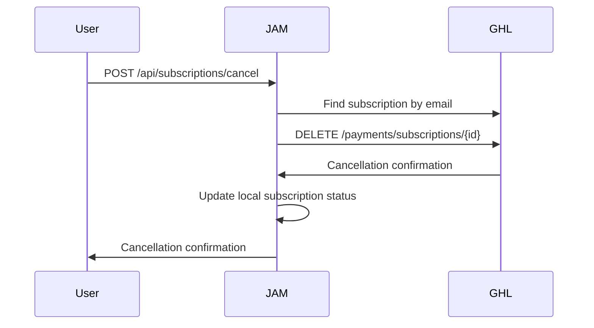
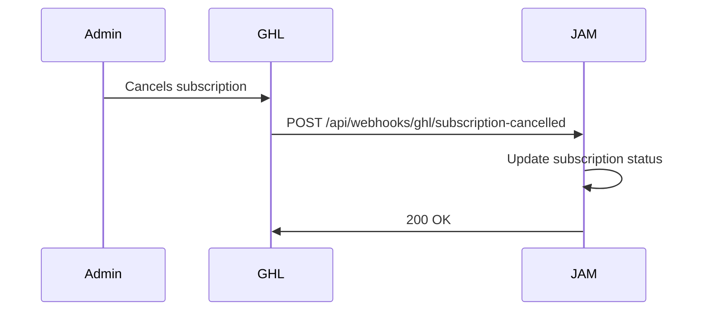

# GoHighLevel Subscription Management Integration

## Overview

This document explains how to integrate JAM Capital's subscription system with GoHighLevel for complete subscription lifecycle management.

## Prerequisites

- GoHighLevel account with API access
- JAM Capital backend server running
- GHL OAuth app configured
- Payment gateway set up in GHL

## 🚀 GoHighLevel Configuration

### 1. Set Up Subscription Products

In your GoHighLevel account:

1. Go to **Payments** → **Products**
2. Create subscription products:

   ```
   Product Name: "DIY Starter"
   Price: $29.00
   Billing Cycle: Monthly
   Trial Period: 0 days

   Product Name: "DIY Professional"
   Price: $59.00
   Billing Cycle: Monthly
   Trial Period: 0 days

   Product Name: "DIY Premium"
   Price: $99.00
   Billing Cycle: Monthly
   Trial Period: 0 days
   ```

### 2. Configure Webhooks

Set up webhooks for subscription events:

1. Go to **Settings** → **Integrations** → **Webhooks**
2. Add the following webhook endpoints:

#### Payment Success Webhook

```
URL: https://yourdomain.com/api/webhooks/ghl/payment-success
Method: POST
Events:
  - payment.success
  - subscription.created
  - subscription.renewed
```

#### Subscription Cancelled Webhook

```
URL: https://yourdomain.com/api/webhooks/ghl/subscription-cancelled
Method: POST
Events:
  - subscription.cancelled
  - subscription.expired
```

#### Payment Failed Webhook

```
URL: https://yourdomain.com/api/webhooks/ghl/payment-failed
Method: POST
Events:
  - payment.failed
  - payment.declined
```

### 3. API Endpoints Configuration

The JAM backend expects these GHL API endpoints to be available:

```javascript
// Cancel subscription
DELETE /payments/subscriptions/{subscriptionId}

// Pause subscription
PUT /payments/subscriptions/{subscriptionId}/pause

// Get subscription details
GET /payments/subscriptions/{subscriptionId}

// Search subscriptions by contact
GET /payments/subscriptions?contactId={contactId}&locationId={locationId}
```

## 🔧 Environment Variables

Add these to your `.env` file:

```env
# GoHighLevel Configuration
GHL_LOCATION_ID=your_location_id_here
GHL_CLIENT_ID=your_client_id_here
GHL_CLIENT_SECRET=your_client_secret_here
GHL_WEBHOOK_SECRET=your_webhook_secret_here
GHL_BASE_URL=https://services.leadconnectorhq.com

# Payment Links (from GHL)
GHL_STARTER_PAYMENT_LINK=https://your-ghl-domain.com/diy-starter-payment
GHL_PROFESSIONAL_PAYMENT_LINK=https://your-ghl-domain.com/diy-professional-payment
GHL_PREMIUM_PAYMENT_LINK=https://your-ghl-domain.com/diy-premium-payment
```

## 📋 Subscription Lifecycle Workflow

### 1. User Subscribes (GHL → JAM)


### 2. User Cancels (JAM → GHL)



### 3. GHL-Initiated Cancellation (GHL → JAM)



## 🛠️ Testing the Integration

### 1. Test Webhook Endpoints

```bash
# Test payment success webhook
curl -X POST https://yourdomain.com/api/webhooks/ghl/payment-success \
  -H "Content-Type: application/json" \
  -d '{
    "email": "test@example.com",
    "product_name": "DIY Starter",
    "subscription_id": "sub_123456",
    "amount": 29.00
  }'

# Test cancellation webhook
curl -X POST https://yourdomain.com/api/webhooks/ghl/subscription-cancelled \
  -H "Content-Type: application/json" \
  -d '{
    "email": "test@example.com",
    "subscription_id": "sub_123456",
    "cancellation_reason": "customer_requested"
  }'
```

### 2. Test JAM-Initiated Cancellation

```bash
# Test cancellation endpoint (requires auth token)
curl -X POST https://yourdomain.com/api/subscriptions/cancel \
  -H "Content-Type: application/json" \
  -H "Authorization: Bearer YOUR_JWT_TOKEN" \
  -d '{
    "cancellationReason": "not_using_enough",
    "feedback": "Service is great but I dont use it enough",
    "cancellationType": "end_of_period"
  }'
```

## ⚙️ Advanced Configuration

### 1. Webhook Security

Implement webhook signature validation:

```javascript
import crypto from "crypto";

function validateGHLWebhook(payload, signature, secret) {
  const expectedSignature = crypto
    .createHmac("sha256", secret)
    .update(payload)
    .digest("hex");

  return crypto.timingSafeEqual(
    Buffer.from(signature, "hex"),
    Buffer.from(expectedSignature, "hex")
  );
}
```

### 2. Error Handling & Retries

```javascript
// In your cancellation endpoint
try {
  const ghlResult = await ghlService.cancelSubscription(subscriptionId, reason);

  if (!ghlResult.success) {
    // Log for manual review
    console.error("GHL cancellation failed:", ghlResult.error);

    // Continue with local cancellation
    // Admin can manually cancel in GHL later
  }
} catch (error) {
  // Don't fail the entire request if GHL is down
  console.error("GHL service unavailable:", error.message);
}
```

### 3. Sync Status Check

Create a periodic job to sync subscription statuses:

```javascript
// Run daily to sync subscription statuses
async function syncSubscriptionStatuses() {
  const users = await User.find({ "subscription.tier": { $ne: "free" } });

  for (const user of users) {
    try {
      const ghlSubs = await ghlService.findSubscriptionByEmail(user.email);
      // Compare and sync statuses
    } catch (error) {
      console.error(`Sync failed for ${user.email}:`, error);
    }
  }
}
```

## 🔍 Monitoring & Troubleshooting

### Common Issues

1. **GHL API Rate Limits**

   - Implement exponential backoff
   - Use queuing for bulk operations

2. **Webhook Delivery Failures**

   - Set up webhook retry logic in GHL
   - Monitor webhook logs

3. **Subscription Status Mismatches**
   - Run periodic sync jobs
   - Implement manual reconciliation tools

### Logging

Monitor these log patterns:

```
✅ Successfully cancelled GHL subscription: sub_123456
⚠️ GHL cancellation failed: [error details]
📝 No active GHL subscription found for user@example.com
❌ Error with GHL cancellation: [error details]
```

## 📊 Analytics & Reporting

Track subscription metrics:

- Cancellation rates by reason
- GHL vs JAM-initiated cancellations
- Failed webhook deliveries
- Subscription status sync issues

## 🚀 Production Checklist

- [ ] All webhook endpoints configured in GHL
- [ ] Environment variables set
- [ ] Payment links tested
- [ ] Webhook signatures validated
- [ ] Error handling implemented
- [ ] Monitoring setup
- [ ] Sync jobs scheduled
- [ ] Admin tools for manual intervention

## 📞 Support

For GHL API issues:

- Check GHL API documentation
- Contact GHL support
- Review GHL API status page

For JAM integration issues:

- Check server logs
- Review webhook delivery logs
- Test endpoints manually
