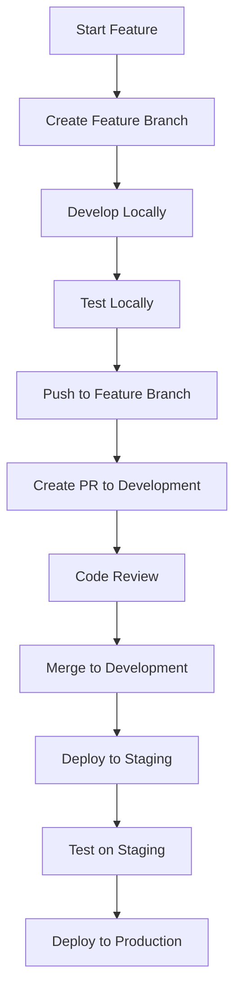

# JAM Capital Consultants - Git Branching Strategy

## 🌳 **BRANCH STRUCTURE OVERVIEW**

```
📦 JAM Capital Git Repository
├── 🚀 main (production)              ← Live production code
├── 🧪 staging                        ← Pre-production testing
├── 🔧 development                    ← Active development integration
├── 🌿 feature/authentication-fix     ← Individual features
├── 🌿 feature/ghl-enhancement        ← Individual features
├── 🌿 hotfix/critical-bug-fix        ← Emergency production fixes
└── 🌿 release/v1.2.0                 ← Release preparation
```

## 🎯 **BRANCH PURPOSES & ENVIRONMENT MAPPING**

### **🚀 `main` Branch (Production)**

- **Purpose:** Production-ready, stable code
- **Environment:** Production deployment
- **Protection:** Highly protected, requires pull request reviews
- **Auto-Deploy:** Yes → `jam-capital-backend.azurewebsites.net`

```bash
Environment: PRODUCTION
URL: https://jam-capital-backend.azurewebsites.net
Database: jamdb (production)
Storage: jam-uploads (production)
```

### **🧪 `staging` Branch (Pre-Production)**

- **Purpose:** Final testing before production
- **Environment:** Staging deployment
- **Protection:** Protected, requires testing verification
- **Auto-Deploy:** Yes → `jam-capital-staging.azurewebsites.net`

```bash
Environment: STAGING
URL: https://jam-capital-staging.azurewebsites.net
Database: jamdb-staging
Storage: jam-uploads-staging
```

### **🔧 `development` Branch (Development Integration)**

- **Purpose:** Integration of completed features
- **Environment:** Development server (optional auto-deploy)
- **Protection:** Light protection, allows direct commits
- **Testing:** Continuous integration testing

```bash
Environment: DEVELOPMENT
URL: http://localhost:3000 (local) or dev server
Database: jamdb-development
Storage: jam-uploads-dev
```

### **🌿 Feature Branches**

- **Purpose:** Individual feature development
- **Environment:** Local development
- **Naming:** `feature/description-of-feature`
- **Lifespan:** Created from `development`, merged back to `development`

---

## 🔄 **DEVELOPMENT WORKFLOW**

### **Daily Development Process**



### **1. Starting a New Feature**

```bash
# Start from development branch
git checkout development
git pull origin development

# Create new feature branch
git checkout -b feature/user-dashboard-enhancement

# Work on your feature
# Edit files, test locally...
```

### **2. Development & Testing**

```bash
# Regular commits during development
git add .
git commit -m "feat: add user dashboard search functionality"

# Test locally using development environment
npm run dev
node ../scripts/health-check.js

# Push feature branch to GitHub
git push origin feature/user-dashboard-enhancement
```

### **3. Integration to Development**

```bash
# Create Pull Request on GitHub:
# FROM: feature/user-dashboard-enhancement
# TO: development

# After PR approval and merge, clean up
git checkout development
git pull origin development
git branch -d feature/user-dashboard-enhancement
```

### **4. Staging Deployment**

```bash
# When ready for staging testing
git checkout staging
git pull origin staging

# Merge development into staging
git merge development
git push origin staging

# This triggers automatic staging deployment
```

### **5. Production Deployment**

```bash
# After staging testing passes
git checkout main
git pull origin main

# Merge staging into main
git merge staging
git push origin main

# This triggers automatic production deployment
```

---

## 🛡️ **BRANCH PROTECTION RULES**

### **Main Branch Protection (Critical)**

```yaml
Required status checks:
  - ✅ All tests must pass
  - ✅ Health checks must pass
  - ✅ Security scan must pass

Pull Request Requirements:
  - ✅ At least 1 approval required
  - ✅ Up-to-date with base branch
  - ✅ Linear history required

Additional Settings:
  - ✅ Restrict pushes that create files over 100MB
  - ✅ Require signed commits (recommended)
  - ✅ Dismiss stale reviews when new commits are pushed
```

### **Staging Branch Protection (Important)**

```yaml
Required status checks:
  - ✅ Basic tests must pass
  - ✅ Health checks must pass

Pull Request Requirements:
  - ✅ At least 1 approval (can be self-approval)
  - ✅ Up-to-date with base branch
```

### **Development Branch Protection (Light)**

```yaml
Settings:
  - ✅ Allow force pushes (for development flexibility)
  - ✅ Allow deletions
  - ⚠️ Basic branch protection only
```

---

## 🚀 **SETUP INSTRUCTIONS**

### **1. Initialize Git Branching Structure**

```bash
# Ensure you're in the JAM Website directory
cd "JAM Website"

# Check current branch
git branch

# Create and setup development branch
git checkout -b development
git push -u origin development

# Create and setup staging branch
git checkout -b staging
git push -u origin staging

# Return to main
git checkout main
```

### **2. Configure Branch Protection (GitHub Web Interface)**

**Go to:** GitHub Repository → Settings → Branches

**Main Branch:**

1. Click "Add rule"
2. Branch name pattern: `main`
3. Enable "Require pull request reviews before merging"
4. Enable "Require status checks to pass before merging"
5. Enable "Include administrators"
6. Save changes

**Staging Branch:**

1. Click "Add rule"
2. Branch name pattern: `staging`
3. Enable "Require pull request reviews before merging"
4. Save changes

### **3. Setup Automatic Deployments**

**GitHub Actions Workflow (`.github/workflows/deploy.yml`):**

```yaml
name: JAM Capital CI/CD Pipeline

on:
  push:
    branches: [main, staging, development]
  pull_request:
    branches: [main, staging, development]

jobs:
  test:
    runs-on: ubuntu-latest
    steps:
      - uses: actions/checkout@v3
      - name: Setup Node.js
        uses: actions/setup-node@v3
        with:
          node-version: "18"
      - name: Install dependencies
        run: cd Backend && npm install
      - name: Run tests
        run: cd Backend && npm test

  deploy-production:
    if: github.ref == 'refs/heads/main'
    needs: test
    runs-on: ubuntu-latest
    steps:
      - name: Deploy to Production
        run: echo "Deploy to jam-capital-backend.azurewebsites.net"

  deploy-staging:
    if: github.ref == 'refs/heads/staging'
    needs: test
    runs-on: ubuntu-latest
    steps:
      - name: Deploy to Staging
        run: echo "Deploy to jam-capital-staging.azurewebsites.net"
```

---

## 📋 **BRANCH NAMING CONVENTIONS**

### **Feature Branches**

```bash
feature/user-authentication-improvement
feature/ghl-payment-integration
feature/dashboard-performance-optimization
feature/security-enhancement
```

### **Hotfix Branches**

```bash
hotfix/critical-payment-bug
hotfix/security-vulnerability
hotfix/database-connection-issue
```

### **Release Branches**

```bash
release/v1.2.0
release/v1.2.1-hotfix
release/major-update-v2.0.0
```

---

## 🔥 **EMERGENCY PROCEDURES**

### **Production Hotfix Workflow**

```bash
# For critical production issues

# 1. Create hotfix branch from main
git checkout main
git pull origin main
git checkout -b hotfix/critical-issue-description

# 2. Fix the issue quickly
# Edit files, test locally

# 3. Commit and push
git add .
git commit -m "hotfix: resolve critical payment processing issue"
git push origin hotfix/critical-issue-description

# 4. Create PR directly to main (emergency)
# Merge immediately after review

# 5. Also merge back to development and staging
git checkout development
git merge main
git checkout staging
git merge main
```

### **Rollback Procedure**

```bash
# If production deployment fails

# 1. Quick rollback to previous commit
git checkout main
git reset --hard HEAD~1  # Go back 1 commit
git push --force-with-lease origin main

# 2. Or rollback to specific version
git checkout main
git reset --hard <previous-good-commit-hash>
git push --force-with-lease origin main
```

---

## 📊 **DEVELOPMENT WORKFLOW EXAMPLES**

### **Example 1: Adding New Feature**

```bash
# Week 1: Start feature
git checkout development
git checkout -b feature/enhanced-user-dashboard
# Develop and test locally

# Week 1 End: Push to GitHub
git push origin feature/enhanced-user-dashboard
# Create PR to development

# Week 2: After PR approval
git checkout development  # Switch to development
git pull origin development  # Get latest including your merged feature

# Week 2: Deploy to staging for testing
git checkout staging
git merge development
git push origin staging  # Auto-deploys to staging

# Week 2 End: After staging testing passes
git checkout main
git merge staging
git push origin main  # Auto-deploys to production
```

### **Example 2: Multiple Developers**

```bash
# Developer A working on authentication
git checkout -b feature/auth-improvements

# Developer B working on payments
git checkout -b feature/payment-enhancements

# Both merge to development independently
# Both features tested together in staging
# Both deployed to production together
```

---

## ✅ **VERIFICATION CHECKLIST**

Before setting up, ensure you have:

- [ ] ✅ Local development environment working
- [ ] ✅ Staging environment configured
- [ ] ✅ Production environment stable
- [ ] ✅ GitHub repository access
- [ ] ✅ Azure deployment pipeline access
- [ ] ✅ Team members added to repository
- [ ] ✅ Branch protection rules configured
- [ ] ✅ CI/CD pipeline tested

---

## 🎯 **BENEFITS OF THIS STRATEGY**

### **🛡️ Production Safety**

- Main branch always represents working production code
- No direct commits to production
- All changes reviewed and tested

### **🧪 Testing Reliability**

- Staging environment mirrors production
- Full testing before production deployment
- Integration testing in development environment

### **🔄 Development Efficiency**

- Parallel feature development
- Easy rollback procedures
- Clear deployment pipeline

### **📈 Team Collaboration**

- Code review process
- Clear feature isolation
- Merge conflict resolution

---

## 🚀 **QUICK START COMMANDS**

### **Setup Repository Structure**

```bash
# Clone repository and setup branches
git clone <your-repo-url>
cd "JAM Website"

# Create branch structure
git checkout -b development
git push -u origin development

git checkout -b staging
git push -u origin staging

git checkout main
```

### **Daily Development**

```bash
# Start new feature
git checkout development
git checkout -b feature/my-new-feature

# Development workflow
git add .
git commit -m "feat: description"
git push origin feature/my-new-feature

# Create PR on GitHub: feature/my-new-feature → development
```

### **Deployment Workflow**

```bash
# Deploy to staging
git checkout staging
git merge development
git push origin staging

# Deploy to production
git checkout main
git merge staging
git push origin main
```

This branching strategy provides the **code safety and deployment control** you need while maintaining development efficiency!
